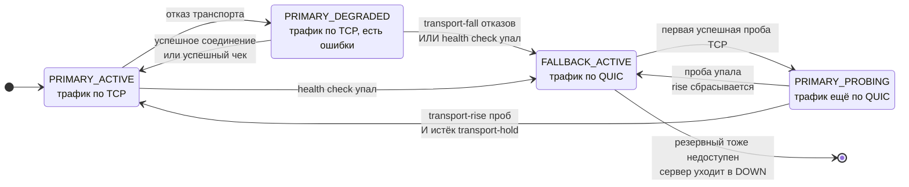
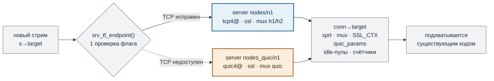

# HAProxy · transport failover TCP → QUIC

[](https://git.haproxy.org/?p=haproxy-3.4.git)
[](https://github.com/blantxxv/haproxy-transport-failover/compare/v3.4.5...transport-failover)
[](#результаты)
[](#интеграционный-стенд)
[](#санитайзеры)
[](#сборка)

> Backend-сервер получает **резервный транспорт**. Пока TCP работает — соединения идут по TCP.
> Когда TCP перестаёт устанавливаться, новые соединения сами уходят на QUIC. Когда TCP устойчиво
> восстанавливается — возвращаются обратно. Без reload, без внешнего watchdog'а, средствами самой
> архитектуры HAProxy.

Установленные соединения **не** миграруют: у TCP и QUIC разная семантика. Переключается только то,
что открывается заново.

```haproxy
# резервный транспорт: тот же узел, но по QUIC — свой протокол, xprt, mux, TLS и health check
backend nodes_quic
    mode http
    server n1 quic4@10.0.0.2:443 ssl verify none alpn h3 check

# основной транспорт: TCP, со ссылкой на резервный
backend nodes
    mode http
    server n1 10.0.0.2:443 check inter 2s fall 3 rise 2 fallback-transport nodes_quic/n1 transport-fall 3 transport-rise 5 transport-probe 5s transport-hold 30s
```

Состояние в рантайме:

```console
$ echo "show servers transport" | socat /var/run/haproxy.sock -
nodes/n1 4/1 state=FALLBACK_ACTIVE current=fallback primary=down fallback=nodes_quic/n1:up
  fail=0/3 rise=2/5 fb_fail=0 switches=1 fb_conns=128 prim_fail=3 recov=1
  probe=5000ms hold=30000ms last_change=2486ms reason=health check
```

📄 **Оформленный отчёт со всеми деталями:** [claude.ai/code/artifact/75a273de](https://claude.ai/code/artifact/75a273de-4aae-489c-8459-a658d9f98f48)

---

## Содержание

- [Конечный автомат](#конечный-автомат)
- [Почему резервный транспорт — отдельный сервер](#почему-резервный-транспорт--отдельный-сервер)
- [Что считается отказом транспорта](#что-считается-отказом-транспорта)
- [Директивы](#директивы)
- [Наблюдаемость](#наблюдаемость)
- [Результаты](#результаты)
- [Ограничение: `mode tcp` + QUIC](#ограничение-mode-tcp--quic)
- [Сборка](#сборка)
- [Тесты](#тесты)
- [Что изменено](#что-изменено)
- [Ограничения](#ограничения)
- [Планы на upstream](#планы-на-upstream)

---

## Конечный автомат



Основной транспорт зондирует **собственный health check сервера** — он и так нацелен на него, так что
отдельный пробер не понадобился. `transport-probe` лишь подменяет ему интервал на время работы
резервного транспорта.

Если резервный транспорт тоже перестал работать, автомат прекращает «поглощать» отказ чека — и сервер
уходит в DOWN штатным путём: балансировщик перестаёт его выбирать, клиент получает честный 503 вместо
бесконечных retry.

### Гистерезис на четырёх механизмах

| Механизм | Назначение | По умолчанию |
|---|---|---|
| `transport-fall` | сколько подтверждённых отказов нужно, чтобы уйти на резервный | 3 |
| `transport-rise` | сколько успешных проб нужно, чтобы вернуться | 5 |
| `transport-hold` | минимальное время на резервном транспорте | 30s |
| `fall` / `rise` чека | штатный гистерезис health check'а | 3 / 2 |

EWMA сознательно не вводилась: первая реализация должна быть детерминированной и предсказуемой.

**Измерено:** 5 циклов «TCP лежит 4 с / TCP работает 4 с» дают 5 переключений вместо 10, которые
сделала бы реализация без hold-down.

```
переключений за 5 циклов флаппинга
без гистерезиса (ожидаемо)  ████████████████████  10
факт                        ██████████░░░░░░░░░░   5
```

---

## Почему резервный транспорт — отдельный сервер



При разборе кода выяснилось, что **всё, что определяет транспорт, — свойства одного
`struct server`**, и большая часть достаётся через `conn->target`:

| Составляющая | Источник в upstream v3.4.5 |
|---|---|
| адрес назначения | `alloc_dst_address()` → `srv->addr` + `srv->svc_port` |
| протокол сокета | `protocol_lookup(family, srv->addr_type.proto_type, srv->alt_proto)` |
| транспортный слой | `conn_prepare(conn, proto, srv->xprt)` |
| мультиплексор | `conn_install_mux_be()` → `objt_server(conn->target)->mux_proto` |
| TLS-контекст, SNI, ALPN | `objt_server(conn->target)->ssl_ctx` |
| пулы idle-соединений | `srv->per_thr[]`, `srv->per_tgrp[]` |

При этом **один сервер не может быть TCP+TLS и QUIC одновременно**: `srv->xprt` назначается один раз
при инициализации, а `SSL_CTX` создаётся по-разному — `ssl_sock_new_ssl_ctx(srv_is_quic(srv))`, со
своими дефолтами ciphersuites и curves для QUIC.

Отсюда решение: резервный транспорт — **обычный сервер в другом backend'е**, а переключение — выбор
объекта, на который нацелено соединение. Форма ссылки взята у существующего ключевого слова `track` и
разрешается тем же способом, в `check_config_validity()`.

**Что это даёт бесплатно:** у резервного транспорта свой health check, свои счётчики и своя строка в
статистике; idle-соединения двух транспортов не могут перемешаться, потому что пулы принадлежат
серверу. Нового транспортного кода в патче нет.

---

## Что считается отказом транспорта

| ✗ Считаем отказом транспорта | ✓ Не считаем — проблема локальная |
|---|---|
| connect timeout (`STRM_ET_CONN_TO`) | исчерпание портов (`CO_ER_FREE_PORTS`) |
| connection refused, network / host unreachable, RST при установке (`CO_ER_SOCK_ERR`) | исчерпание FD и памяти (`CO_ER_*_FDLIM`, `CO_ER_SYS_MEMLIM`) |
| провал handshake'а поверх установленного транспорта (`CO_ER_SSL_HANDSHAKE`, `CO_ER_PRX_*`) — для QUIC это, в том числе, как выглядит «чёрная дыра» | несовпадение сертификата и ошибки TLS (`CO_ER_SSL_MISMATCH_SNI`, `CO_ER_SSL_CA_FAIL`) — смена транспорта скрыла бы настоящую ошибку |

**Защита от «одной сессии»:** учитывается не более одной ошибки на стрим
(`if (s->conn_retries) return SRV_TF_ERR_NONE;`) — иначе один клиент с `retries 3` в одиночку дотянул
бы счётчик до порога.

Источников доказательств два и они независимы: data plane (порог `transport-fall`) и health check
(его собственный `fall`). Чек — более надёжный признак «проблема серверная», поэтому его отказ
переключает транспорт сразу, опираясь на уже отработавший гистерезис чека.

### Время переключения по типу отказа

```
RST / connection refused   ██████░░░░░░░░░░░░░░   ~2 с
health check исчерпал fall ██████░░░░░░░░░░░░░░   ~2 с
blackhole (SYN дропается)  ███████████░░░░░░░░░   3–4 с   ограничено connect timeout
```

Измерено на стенде при `inter 1s fall 2`, `timeout connect 1s`.

---

## Директивы

Все — на строке `server`. Полная справка в `doc/configuration.txt`, ключевое слово
`fallback-transport`.

| Директива | Значение | Default |
|---|---|---|
| `fallback-transport [<backend>/]<server>` | сервер, описывающий резервный транспорт | — |
| `transport-fall <count>` | отказов на data plane до переключения | `3` |
| `transport-rise <count>` | успешных проб основного транспорта до возврата | `5` |
| `transport-probe <time>` | интервал проб основного транспорта, пока активен резервный | `5s` |
| `transport-hold <time>` | минимальное время на резервном транспорте | `30s` |

Валидация отвергает ошибочные комбинации на `haproxy -c` с внятным текстом:

<details>
<summary>Фактический вывод проверок конфигурации</summary>

```
no 'check' on primary:      server 'nodes/n1' uses a fallback transport and therefore requires 'check'
unknown fallback server:    unable to find server 'nope' in backend 'nodes_quic' for the fallback transport of server 'n1'
unknown fallback backend:   unable to find backend 'nobackend' for the fallback transport of server 'n1'
self reference:             server 'nodes/n1' cannot use itself as a fallback transport
proxy mode mismatch:        backend 'nodes_quic' : MUX protocol 'quic' is not usable for server 'n1'
transport-fall 0:           'transport-fall' has to be > 0
bad time unit:              unexpected character 'x' in argument to <transport-hold>
chained fallback:           server 'b/n1' cannot be used as the fallback transport of 'a/n1' because
                            it defines a fallback transport itself
mode tcp + quic fallback:   backend 'nodes_quic' : MUX protocol 'quic' is not usable for server 'n1'
```

</details>

> [!NOTE]
> HAProxy **не поддерживает перенос строк через `\`** в конфигурации — парсер видит обратный слэш как
> отдельное ключевое слово (`unknown keyword '\'`). Директива `server` должна быть одной строкой.

---

## Наблюдаемость

**Runtime API** — новая команда, существующие форматы `show servers state` и `show servers conn` не
тронуты:

```console
$ echo "show servers transport nodes" | socat /var/run/haproxy.sock -
# bkname/svname bkid/svid state= current= primary= fallback= fail=cur/thres rise=cur/thres ...
nodes/n1 4/1 state=PRIMARY_PROBING current=fallback primary=down fallback=nodes_quic/n1:up
  fail=0/3 rise=2/3 fb_fail=0 switches=1 fb_conns=4 prim_fail=0 recov=1 reason=health check
```

**Статистика** — 7 колонок, добавлены строго в конец CSV (обратная совместимость сохранена), в
stats-file не попадают:

| Колонка | Тип | Prometheus |
|---|---|---|
| `transport_current` | `primary` / `fallback` | — (текстовая) |
| `transport_state` | имя состояния автомата | — (текстовая) |
| `transport_fb_active` | gauge 0/1 | `haproxy_server_fallback_transport_active` |
| `transport_switches` | counter | `haproxy_server_transport_switches_total` |
| `transport_fb_conns` | counter | `haproxy_server_fallback_transport_connections_total` |
| `transport_prim_failures` | counter | `haproxy_server_primary_transport_failures_total` |
| `transport_recov_attempts` | counter | `haproxy_server_transport_recovery_attempts_total` |

Серверы без failover в Prometheus не попадают — никаких `NaN`.

**Логи** — на каждый переход, не чаще одного сообщения на интервал пробы:

```log
Server nodes/n1 transport: primary transport declared unusable by its health check,
  switching to fallback transport nodes_quic/n1.
Server nodes/n1 transport: primary transport probe successful 1/5.
Server nodes/n1 transport: primary transport recovered (primary probes succeeded),
  switching back from fallback transport nodes_quic/n1.
```

---

## Результаты

Патч накладывается на чистый tarball `haproxy-3.4.5.tar.gz` и собирается **без единого warning'а**.
Окружение: Debian 13, kernel 6.12, 2 ядра, OpenSSL 3.5.7 (`+QUIC`, без `QUIC_OPENSSL_COMPAT`).

### Регрессионные тесты upstream (VTest2)

| Прогон | Результат |
|---|---|
| upstream v3.4.5 — эталон | `0 failed · 1 skipped · 279 passed` |
| **этот форк, тот же набор** | `0 failed · 1 skipped · 280 passed` |

280 против 279 — это ровно новый `reg-tests/checks/transport-failover.vtc`. Ни один существующий
тест не сломан.

Этот прогон нашёл настоящую ошибку в патче: набор запускает HAProxy с `-dW` (zero-warning), а
предупреждение «резервный сервер без своего `check`» делало валидную конфигурацию нестартующей.
Исправлено переводом сообщения в `ha_diag_warning()`.

### Интеграционный стенд

Клиент, HAProxy и узел связаны veth-парами в отдельных network namespace'ах; узел отдаёт один и тот
же сервис по TCP и по QUIC разными телами ответа. Отказы вносятся через `nftables` и `tc netem`.
Трафик чеков разведён на отдельные порты, поэтому захват на сервисном порту содержит **только data
plane** — вердикт «каким транспортом идёт трафик» выносится по pcap, а не по логам HAProxy.

**34 из 34 проверок PASS.**

| № | Сценарий | Факт |
|:-:|---|---|
| 1 | оба транспорта живы | 1 TCP SYN, **0** QUIC-датаграмм в pcap |
| 2 | блокирован только TCP | 8 QUIC-датаграмм, **0** новых TCP SYN, `switches=1` |
| 3 | TCP вернулся | сразу после разблокировки трафик *ещё* на fallback; возврат через 5 с |
| 4 | потеря пакетов 12 % | 12/12 запросов по TCP, счётчик переключений не изменился |
| 5 | blackhole, SYN дропается | переключение за 3–4 с по connect timeout |
| 6 | RST / connection refused | переключение за 2 с |
| 7 | оба транспорта недоступны | честный HTTP 503 за 3 с, сервер DOWN, без бесконечных retry |
| 8 | fallback умер после переключения | `fb_fail=3`, `reason=fallback transport unusable`, сервер DOWN |
| 9 | флаппинг TCP, 5 циклов 4с/4с | **5 переключений вместо 10** |
| 10 | нагрузка | 600/600 по TCP, затем 600/600 по QUIC |

<details>
<summary>Демонстрация полного жизненного цикла — фактический вывод <code>run.sh demo</code></summary>

```
--- 1. TCP UP: the primary transport carries the traffic ---
    request 1 -> via-tcp
    runtime : state=PRIMARY_ACTIVE current=primary primary=up fallback=nodes_quic/n1:up switches=0
    packets : 3 new TCP connections, 0 QUIC datagrams on the service port
    verdict : traffic flows over TCP

>>> injecting failure: nft drop on tcp dport 4443 and 4444

--- 2. TCP DOWN: the fallback transport took over ---
    request 1 -> via-quic
    runtime : state=FALLBACK_ACTIVE current=fallback primary=down switches=1 reason=health check
    packets : 0 new TCP connections, 22 QUIC datagrams on the service port
    verdict : traffic flows over QUIC
    logs    : primary transport declared unusable by its health check,
              switching to fallback transport nodes_quic/n1.

>>> TCP restored, the primary transport is being probed

--- 3. TCP RECOVERING: probes succeed, traffic still on the fallback ---
    request 1 -> via-quic
    runtime : state=PRIMARY_PROBING current=fallback rise=2/3 switches=1 recov=1
    packets : 0 new TCP connections, 8 QUIC datagrams on the service port
    verdict : traffic flows over QUIC

--- 4. TCP ACTIVE: traffic is back on the primary transport ---
    request 1 -> via-tcp
    runtime : state=PRIMARY_ACTIVE current=primary switches=2 reason=primary probes succeeded
    packets : 3 new TCP connections, 0 QUIC datagrams on the service port
    verdict : traffic flows over TCP
    logs    : primary transport probe successful 1/3.
              primary transport probe successful 2/3.
              primary transport recovered (primary probes succeeded),
              switching back from fallback transport nodes_quic/n1.
```

Фаза 3 — самое показательное место: состояние уже `PRIMARY_PROBING`, пробы TCP проходят
(`rise=2/3`), но трафик всё ещё идёт по QUIC — ни одного нового TCP-соединения в захвате. Это и есть
работающий гистерезис.

</details>

### Многопоточность

Переход состояния сериализуется **CAS-циклом**: лог и инкремент счётчика переключений делает ровно
тот поток, который выиграл CAS. Новых блокировок на hot path нет. Unit-тест написан как ловушка для
двойных переходов:

```console
$ ./haproxy -U srv_tf
Testing transport failover state machine
  8 threads x 20000 rounds x 2 phases: 2 switches, 1 recoveries, 160000 failures counted
All transport failover checks passed
```

Ровно 2 перехода на 160 000 конкурентных событий — а не по одному на поток.

### Санитайзеры

| Сборка | Unit-тесты | Интеграционные 1–3 | Замечания |
|---|:-:|:-:|---|
| ASan + UBSan | ✅ | 17/17 | сообщения UBSan только в `src/haproxy.c:3478` — механизм INITCALL самого upstream |
| TSan, `nbthread 4` | ✅ | 17/17 | 106 предупреждений, все в upstream-файлах; упоминаний нового модуля — **0** |

Чтобы это не было отговоркой, снят эталон: **чистый upstream v3.4.5 под TSan на 200 запросах даёт
130 предупреждений** в тех же самых файлах (`task.c` 126, `haproxy.c` 102, `listener.c` 80,
`session.c` 61, `sock.c` 33, `fd.c` 30). Это известный шум HAProxy на собственных атомиках и
барьерах, а не следствие патча.

LeakSanitizer нашёл утечку 40 байт — и она **не из нового кода**: стек указывает на
`ssl_sock_init_srv()` / `src/cfgparse-ssl.c:1880`, где upstream выделяет дефолтные curves для
QUIC-сервера. Воспроизводится конфигурацией с обычным `quic4@` сервером *без единой новой директивы*
— то есть это баг upstream, который стоит отправить отдельно.

### Бенчмарк

CPU-микросекунды на запрос, три экземпляра HAProxy подняты одновременно и нагружаются **мелкими
чередующимися раундами** по 5000 запросов, 15 раундов, медиана:

| Вариант | keepalive | новое соединение | vs upstream |
|---|--:|--:|--:|
| upstream v3.4.5 | 40.0 | 158.0 | — |
| форк, fallback не задан | 40.0 | 158.0 | `+0.00 %` |
| форк, fallback задан, TCP здоров | 40.0 | 160.0 | `+1.27 %` |

```
CPU на новое соединение, мкс
upstream                  ███████████████████░  158.0
форк, без fallback        ███████████████████░  158.0
форк, с fallback          ████████████████████  160.0   в пределах шума
```

На пути передачи данных разницы нет — медианы совпадают. На пути установки соединения регрессии не
обнаружено: все варианты в пределах ±2.3 %, причём порядок между повторными прогонами
**непостоянен** (в контрольном прогоне вариант с fallback оказался «быстрее» варианта без него на
2.27 %). Значит разрешение метода на этом хосте — около ±2–3 %, и реальный эффект меньше порога.

> [!IMPORTANT]
> Это не «цифра для публикации». Полигон — 2 ядра, и на нём же работал сторонний нагруженный
> процесс; PMU-счётчики в VM недоступны (`perf: instructions <not supported>`), поэтому инструкции
> на запрос посчитать нельзя. Для точного числа нужен тихий хост с `perf`.

Согласуется с кодом: при выключенном failover добавка — четыре проверки бита на соединение против
~160 мкс CPU, то есть сотен тысяч инструкций.

```c
static inline struct server *srv_tf_endpoint(struct server *srv)
{
	if (likely(!(srv->flags & SRV_F_TF_ENABLED)))
		return srv;
	return __srv_tf_endpoint(srv);
}
```

---

## Ограничение: `mode tcp` + QUIC

**В `mode tcp` QUIC использовать нельзя, и это ограничение upstream, а не патча.** Оба
QUIC-мультиплексора зарегистрированы только для HTTP-режима (`PROTO_MODE_HTTP` и флаг `MX_FL_HTX` в
`src/mux_quic.c`), а QUIC-серверу этот mux назначается принудительно:

```console
$ ./haproxy -c -f tcp-mode-quic.cfg
[ALERT] backend 'b' : MUX protocol 'quic' is not usable for server 's1' at [cfg:13].
```

Вторая, независимая причина: `mode tcp` работает через `mux_pt` без HTX, а данные QUIC-стрима доходят
до stream-слоя строго через HTX-конвертацию.

### Как это лечится — спроектировано, не реализовано

HTX-связанность **изолирована**: весь обмен между QUIC-мультиплексором и stream-слоем идёт через две
функции в `src/qcm_http.c` — это **124 строки целиком**. Сам слой потоков QUIC (flow control,
RESET_STREAM, FIN) от HTX не зависит.

| Шаг | Объём |
|---|---|
| `src/qcm_raw.c` — аналог без HTX, простой `b_xfer()` в обе стороны, FIN ↔ half-close | ~120 строк |
| новый `qcc_app_ops` без HTX-конвертации (для ориентира: `src/hq_interop.c` — 404 строки, и почти всё в нём — именно эта конвертация) | ~150–250 строк |
| регистрация второго `mux_proto_list` с `PROTO_MODE_TCP`, без `MX_FL_HTX`, со своим ALPN | ~30 строк |

Один стрим = одна QUIC bidi-stream. **Своего framing'а и reliability писать не нужно** — надёжность,
порядок, flow control, congestion control и TLS даёт сам QUIC. Цена вопроса —
интероперабельность: на другом конце должен стоять парный шим. Поэтому в первой версии это
сознательно не сделано: механизм failover'а от такого mux не зависит и добавляется отдельным
коммитом.

Raw UDP не реализован и не предлагается: для потока байт без собственного reliability-слоя это
семантически неверно, а писать свой reliable-UDP при наличии QUIC — ровно то, чего делать не надо.

---

## Сборка

Нужны заголовки **OpenSSL ≥ 3.5.2** для полноценного QUIC (иначе только
`USE_QUIC_OPENSSL_COMPAT=1`, без 0-RTT).

```bash
apt-get install -y libssl-dev zlib1g-dev libpcre2-dev

make -j$(nproc) TARGET=linux-glibc \
     USE_OPENSSL=1 USE_QUIC=1 USE_PCRE2=1 USE_ZLIB=1 USE_THREAD=1 USE_PROMEX=1
```

Сборка с unit-тестами автомата:

```bash
make -j$(nproc) TARGET=linux-glibc USE_OPENSSL=1 USE_QUIC=1 USE_PCRE2=1 USE_ZLIB=1 \
     USE_THREAD=1 USE_PROMEX=1 DEBUG="-DDEBUG_UNIT -DDEBUG_STRICT"
```

Backend-QUIC в upstream всё ещё экспериментальный — в `global` нужен
`expose-experimental-directives`.

## Тесты

```bash
# unit-тесты автомата (нужна сборка с DEBUG_UNIT)
./haproxy -U srv_tf
HAPROXY_PROGRAM=$PWD/haproxy sh scripts/run-unittests.sh

# регрессионный тест (нужен VTest2: scripts/build-vtest.sh)
HAPROXY_PROGRAM=$PWD/haproxy vtest -t 30 reg-tests/checks/transport-failover.vtc

# весь upstream-набор
HAPROXY_PROGRAM=$PWD/haproxy VTEST_PROGRAM=/path/to/vtest sh scripts/run-regtests.sh

# интеграционные тесты в network namespace
# нужен root и ip / nft / tc / tcpdump / socat / curl
sudo ./tests/transport-failover/run.sh          # все 10 сценариев
sudo ./tests/transport-failover/run.sh 2 3      # выборочно
sudo ./tests/transport-failover/run.sh demo     # демонстрация жизненного цикла
```

При падении стенд сохраняет логи HAProxy и узла, pcap, конфигурации и состояние рантайма в
`/tmp/tf-test/artifacts/`.

Рабочий пример конфигурации — [`examples/transport-failover.cfg`](../examples/transport-failover.cfg).

---

## Что изменено

9 коммитов, `+2724 / −41` в 19 файлах — из них примерно 1200 строк это тесты и документация.

| Файл | Δ | Назначение |
|---|--:|---|
| `src/server_tf.c` | +614 | **новый** — конечный автомат, классификация ошибок, логи, резолв конфига, дамп для CLI, unit-тесты |
| `include/haproxy/server_tf.h` | +76 | **новый** — API модуля и inline-функции fast path |
| `include/haproxy/server-t.h` | +55 | `struct srv_tf`, состояния, причины переходов, два флага, поле в `struct server` |
| `src/server.c` | +113 | 5 парсеров ключевых слов, дефолты, копирование настроек, освобождение, хук `srv_getinter()` |
| `src/backend.c` | +100 −41 | выбор транспорта в `connect_server()`, учёт ошибок в `back_handle_st_cer()` |
| `src/proxy.c` | +32 | резолв ссылки в `check_config_validity()`, команда `show servers transport` |
| `src/check.c` | +21 | отдача результатов чека в автомат, «поглощение» отказа вместо DOWN |
| `src/stream.c` | +15 | учёт успешного соединения в `back_establish()` |
| `src/stats-proxy.c` | +39 | описания и заполнение 7 колонок статистики |
| `addons/promex/service-prometheus.c` | +12 | экспорт метрик, пропуск серверов без failover |
| `include/haproxy/stats-t.h` | +7 | новые колонки |
| `Makefile` | +1 | `src/server_tf.o` |
| `doc/configuration.txt` | +131 | документация 5 директив, состояний, классификации ошибок, ограничений |
| `doc/management.txt` | +37 | документация `show servers transport` и его полей |
| `examples/transport-failover.cfg` | +67 | **новый** — рабочий пример |
| `reg-tests/checks/transport-failover.vtc` | новый | регрессионный тест VTest |
| `tests/unit/srv_tf.sh` | новый | запуск unit-тестов автомата |
| `tests/transport-failover/run.sh` | +802 | **новый** — интеграционный стенд на network namespaces |

[Полный diff против v3.4.5 →](https://github.com/blantxxv/haproxy-transport-failover/compare/v3.4.5...transport-failover)

---

## Ограничения

1. **`mode tcp` + QUIC невозможен** на существующем backend-QUIC — см. [выше](#ограничение-mode-tcp--quic). Ошибка выдаётся на `haproxy -c`.
2. **Установленные соединения не миграруют.** Сессии на упавшем транспорте завершаются ошибкой; правда, retry той же сессии уже считается новым соединением, поэтому сессия, чья первая попытка и вызвала переключение, обычно спасается собственным retry.
3. **`check` на основном сервере обязателен** — именно он зондирует основной транспорт. Валидация выдаёт понятную ошибку, если его нет.
4. **Здоровье резервного транспорта без его собственного `check`** определяется только по живому трафику: без трафика отказ не будет замечен до первой реальной сессии.
5. **QUIC-чек нельзя вынести на отдельный порт** — upstream принудительно переводит чек на обычный TCP, как только на server-строке указан `port` или `addr` (`src/check.c:1862`). Ограничение upstream, но влияет на схему тестов.
6. **Цепочки резервных транспортов** (A → B → C) запрещены валидацией.
7. **Динамические серверы** (`add server` через CLI) не могут быть резервным транспортом — как и не могут быть целью `track` в upstream.
8. Чек основного транспорта при активном fallback продолжает падать, поэтому в статистике сервер показывается как `UP 0/2` — жив, но чек не проходит. Отображение честное, но к нему надо привыкнуть; состояние транспорта смотрится отдельными полями.

## Планы на upstream

Уже сделано в расчёте на принятие: стиль кода и именование по принятой манере, opt-in поведение (без
новых директив бинарь ведёт себя как upstream), форматы `show servers state` и `show servers conn` не
тронуты, колонки статистики добавлены строго в конец, в stats-file ничего не попало, сборка без
warning'ов, история из логических коммитов, тесты в штатных каталогах.

Что потребуется дополнительно:

1. **Обсудить синтаксис с мейнтейнерами.** Ссылка на сервер в другом backend'е — мощное, но нестандартное для «транспорта» решение; возможен запрос на inline-форму (`fallback quic4@host:port`), а это потребует рефакторинга `ssl_sock_prepare_srv_ctx()` для второго `SSL_CTX` на сервере.
2. Поддержка динамических серверов и `server-template`: сейчас ссылка разрешается один раз на этапе конфигурации.
3. События `event_hdl` на смену транспорта — в 3.x принято публиковать изменения состояния сервера через `srv_event_hdl_publish*`.
4. Sample fetch вида `be_srv_transport` для ACL и логов.
5. Локализация «поглощения» отказа чека: мейнтейнеры могут предпочесть, чтобы решение принималось внутри `srv_update_status()` вместе с остальной логикой состояний сервера.
6. Активный пробер резервного транспорта — третий экземпляр `struct check` по образцу `srv->agent`, чтобы не зависеть от живого трафика.
7. `transport-probe` как полноценное поле рядом с `fastinter` и `downinter`, а не подмена внутри `srv_getinter()`.

---

<sub>Форк upstream HAProxy, лицензия та же — GPL-2.0-or-later, см. [`LICENSE`](../LICENSE).
Этот файл описывает только изменения ветки; оригинальный README проекта — [`README.md`](../README.md).</sub>
